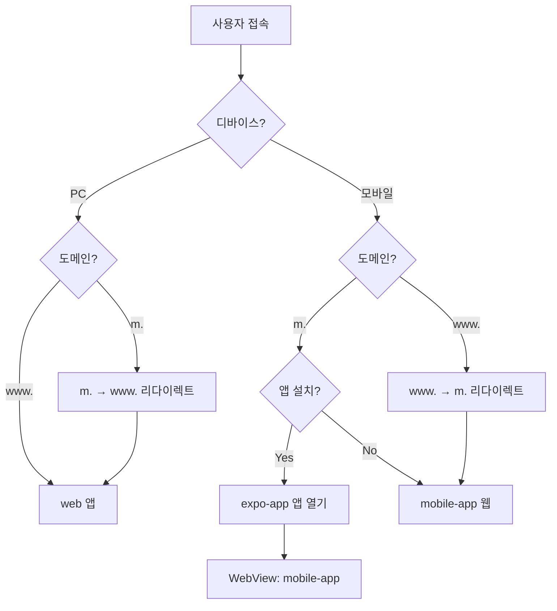

# 하이브리드 앱 아키텍처 구현 계획

## 📋 목차
1. [프로젝트 현황 분석](#1-프로젝트-현황-분석)
2. [목표 아키텍처](#2-목표-아키텍처)
3. [단계별 구현 계획](#3-단계별-구현-계획)
4. [개발 효율성 개선 방안](#4-개발-효율성-개선-방안)
5. [유지보수 전략](#5-유지보수-전략)
6. [체크리스트](#6-체크리스트)

---

## 1. 프로젝트 현황 분석

### 현재 상태 (AS-IS)
```
/DDD3
├── apps
│   ├── web/              ✅ Next.js 15 (포트 3000) - 반응형
│   ├── admin/            ✅ Next.js 15 (포트 3002) - 반응형
│   └── mobile-app/       ⚠️  Next.js 15 - 사용 안 됨, 중복
├── packages
│   ├── design-system/    ✅ 17개 UI 컴포넌트 + 테마
│   ├── api-contract/     ✅ OpenAPI 자동 생성
│   └── types/            ✅ 공유 타입
└── backend/              ✅ Spring Boot 3.2
```

### 문제점
- ❌ `mobile-app`이 `web`과 중복, 차별화 없음
- ❌ 도메인 분기 로직 없음 (www. vs m.)
- ❌ WebView ↔ Native 통신 Bridge 없음
- ❌ 모바일 최적화 UI/UX 부재

### 목표 상태 (TO-BE)
```
/DDD3
├── apps
│   ├── expo-app/         🆕 React Native (Expo)
│   ├── web/              🔄 PC 최적화 (www.domain.com)
│   ├── mobile-app/       🔄 모바일 최적화 (m.domain.com, WebView용)
│   └── admin/            ✅ 유지
├── packages
│   ├── design-system/    ✅ 유지
│   ├── api-contract/     ✅ 유지
│   ├── types/            ✅ 유지
│   ├── native-bridge/    🆕 WebView 통신
│   ├── shared-hooks/     🆕 공통 로직
│   └── mobile-ui/        🆕 모바일 전용 컴포넌트
└── backend/              ✅ 유지
```

---

## 2. 목표 아키텍처

### 2.1 앱별 역할 정의

| 앱 | 도메인 | 포트 | 목적 | 주요 기능 |
|----|--------|------|------|-----------|
| **expo-app** | 앱스토어 | - | 네이티브 쉘 | 네비게이션, 푸시알림, 카메라, 딥링크 |
| **web** | www.community.com | 3000 | PC 웹 | 풀 기능, 복잡한 UI, 테이블, 사이드바 |
| **mobile-app** | m.community.com | 3001 | 모바일 웹 | 간소화 UI, 터치 최적화, 웹뷰용 |
| **admin** | admin.community.com | 3002 | 관리자 | 콘텐츠/사용자 관리 |

### 2.2 사용자 플로우



### 2.3 패키지 의존성

```
expo-app
  └─→ native-bridge
  └─→ api-contract (REST API)

mobile-app
  └─→ native-bridge (앱 감지)
  └─→ mobile-ui
  └─→ design-system
  └─→ api-contract
  └─→ shared-hooks

web
  └─→ design-system
  └─→ api-contract
  └─→ shared-hooks

admin
  └─→ design-system
  └─→ api-contract
  └─→ shared-hooks
```

---

## 3. 단계별 구현 계획

### 🎯 Phase 1: 기반 패키지 구축 (Week 1)

#### 1.1 native-bridge 패키지 생성

**목표**: WebView ↔ React Native 통신 및 디바이스 감지

```bash
# 작업 명령
mkdir -p packages/native-bridge/src
cd packages/native-bridge
pnpm init
```

**파일 구조**:
```
packages/native-bridge/
├── package.json
├── tsconfig.json
└── src/
    ├── index.ts
    ├── webview-bridge.ts      # WebView 통신
    ├── device-detector.ts     # User-Agent 분기
    ├── auth-bridge.ts         # 인증 동기화
    └── types.ts               # 타입 정의
```

**구현 내용**:

```typescript
// packages/native-bridge/src/types.ts
export type MessageType =
  | 'AUTH_LOGIN'
  | 'AUTH_LOGOUT'
  | 'NAVIGATION'
  | 'SHARE'
  | 'NOTIFICATION'
  | 'DEVICE_INFO';

export interface WebViewMessage<T = any> {
  type: MessageType;
  payload: T;
  timestamp: number;
}

export interface DeviceInfo {
  isInApp: boolean;
  isMobile: boolean;
  platform: 'ios' | 'android' | 'web';
  userAgent: string;
}
```

```typescript
// packages/native-bridge/src/webview-bridge.ts
import type { WebViewMessage } from './types';

declare global {
  interface Window {
    ReactNativeWebView?: {
      postMessage: (message: string) => void;
    };
  }
}

export class WebViewBridge {
  private static listeners = new Map<string, Function[]>();

  // 웹뷰 → React Native
  static postMessage<T>(type: string, payload: T): void {
    if (typeof window === 'undefined') return;

    if (window.ReactNativeWebView) {
      const message: WebViewMessage<T> = {
        type: type as any,
        payload,
        timestamp: Date.now()
      };
      window.ReactNativeWebView.postMessage(JSON.stringify(message));
    } else {
      console.warn('[WebViewBridge] Not in app environment');
    }
  }

  // React Native → 웹뷰 (리스너 등록)
  static onMessage<T>(
    type: string,
    callback: (payload: T) => void
  ): () => void {
    if (typeof window === 'undefined') return () => {};

    const handler = (event: MessageEvent) => {
      try {
        const message: WebViewMessage<T> = JSON.parse(event.data);
        if (message.type === type) {
          callback(message.payload);
        }
      } catch (e) {
        console.error('[WebViewBridge] Parse error:', e);
      }
    };

    window.addEventListener('message', handler);

    // Cleanup function
    return () => {
      window.removeEventListener('message', handler);
    };
  }

  // 헬퍼: 로그인 토큰 전송
  static sendAuthToken(token: string): void {
    this.postMessage('AUTH_LOGIN', { token });
  }

  // 헬퍼: 로그아웃 알림
  static sendLogout(): void {
    this.postMessage('AUTH_LOGOUT', {});
  }

  // 헬퍼: 페이지 이동 알림
  static sendNavigation(url: string): void {
    this.postMessage('NAVIGATION', { url });
  }
}
```

```typescript
// packages/native-bridge/src/device-detector.ts
import type { DeviceInfo } from './types';

export class DeviceDetector {
  private static cachedInfo: DeviceInfo | null = null;

  static getDeviceInfo(): DeviceInfo {
    if (this.cachedInfo) return this.cachedInfo;

    const isInApp = this.isInApp();
    const isMobile = this.isMobile();
    const userAgent = typeof navigator !== 'undefined'
      ? navigator.userAgent
      : '';

    let platform: 'ios' | 'android' | 'web' = 'web';
    if (isInApp) {
      platform = /iPad|iPhone|iPod/.test(userAgent) ? 'ios' : 'android';
    }

    this.cachedInfo = {
      isInApp,
      isMobile,
      platform,
      userAgent
    };

    return this.cachedInfo;
  }

  static isInApp(): boolean {
    return typeof window !== 'undefined' && !!window.ReactNativeWebView;
  }

  static isMobile(): boolean {
    if (typeof navigator === 'undefined') return false;
    return /Android|webOS|iPhone|iPad|iPod|BlackBerry|IEMobile|Opera Mini/i
      .test(navigator.userAgent);
  }

  static shouldRedirect(currentHost: string): string | null {
    const { isInApp, isMobile } = this.getDeviceInfo();

    // 앱 내부에서는 리다이렉트 안 함
    if (isInApp) return null;

    const isMobileDomain = currentHost.includes('m.');
    const isWebDomain = currentHost.includes('www.');

    // PC에서 m. 접속 → www.로
    if (!isMobile && isMobileDomain) {
      return currentHost.replace('m.', 'www.');
    }

    // 모바일에서 www. 접속 → m.으로
    if (isMobile && isWebDomain) {
      return currentHost.replace('www.', 'm.');
    }

    return null;
  }

  static clearCache(): void {
    this.cachedInfo = null;
  }
}
```

```typescript
// packages/native-bridge/src/auth-bridge.ts
import { WebViewBridge } from './webview-bridge';
import { DeviceDetector } from './device-detector';

export class AuthBridge {
  // 웹뷰에서 로그인 성공 시
  static async syncAuthToNative(token: string, userId: number): Promise<void> {
    const { isInApp } = DeviceDetector.getDeviceInfo();

    if (isInApp) {
      WebViewBridge.sendAuthToken(token);
    }

    // Cookie에도 저장 (도메인 공유용)
    if (typeof document !== 'undefined') {
      document.cookie = `accessToken=${token}; path=/; domain=.community.com; max-age=3600; SameSite=Lax`;
      document.cookie = `userId=${userId}; path=/; domain=.community.com; max-age=3600; SameSite=Lax`;
    }

    // LocalStorage에도 저장
    if (typeof localStorage !== 'undefined') {
      localStorage.setItem('accessToken', token);
      localStorage.setItem('userId', userId.toString());
    }
  }

  // 로그아웃
  static async logout(): Promise<void> {
    const { isInApp } = DeviceDetector.getDeviceInfo();

    if (isInApp) {
      WebViewBridge.sendLogout();
    }

    // 쿠키 삭제
    if (typeof document !== 'undefined') {
      document.cookie = 'accessToken=; path=/; domain=.community.com; max-age=0';
      document.cookie = 'userId=; path=/; domain=.community.com; max-age=0';
    }

    // LocalStorage 삭제
    if (typeof localStorage !== 'undefined') {
      localStorage.removeItem('accessToken');
      localStorage.removeItem('userId');
    }
  }

  // 네이티브 앱에서 토큰 주입 (WebView 로드 시)
  static getInjectionScript(token?: string, userId?: number): string {
    if (!token) return '';

    return `
      (function() {
        try {
          localStorage.setItem('accessToken', '${token}');
          ${userId ? `localStorage.setItem('userId', '${userId}');` : ''}

          document.cookie = 'accessToken=${token}; path=/; domain=.community.com; max-age=3600';
          ${userId ? `document.cookie = 'userId=${userId}; path=/; domain=.community.com; max-age=3600';` : ''}

          window.dispatchEvent(new Event('auth-sync'));
          console.log('[AuthBridge] Auth injected successfully');
        } catch (e) {
          console.error('[AuthBridge] Injection failed:', e);
        }
      })();
      true;
    `;
  }
}
```

```json
// packages/native-bridge/package.json
{
  "name": "@ddd3/native-bridge",
  "version": "1.0.0",
  "private": true,
  "main": "./src/index.ts",
  "types": "./src/index.ts",
  "scripts": {
    "test": "jest"
  },
  "devDependencies": {
    "typescript": "^5",
    "@types/node": "^22"
  }
}
```

```typescript
// packages/native-bridge/src/index.ts
export * from './webview-bridge';
export * from './device-detector';
export * from './auth-bridge';
export * from './types';
```

**검증**:
- [ ] TypeScript 컴파일 성공
- [ ] 타입 정의 정확성 확인
- [ ] JSDoc 주석 추가

---

#### 1.2 shared-hooks 패키지 생성

**목표**: 공통 React Hook 제공

```bash
mkdir -p packages/shared-hooks/src
cd packages/shared-hooks
pnpm init
```

**파일 구조**:
```
packages/shared-hooks/
├── package.json
├── tsconfig.json
└── src/
    ├── index.ts
    ├── useAppDetection.ts
    ├── useWebViewBridge.ts
    ├── useDeviceRedirect.ts
    └── useSharedAuth.ts
```

**구현 내용**:

```typescript
// packages/shared-hooks/src/useAppDetection.ts
import { useState, useEffect } from 'react';
import { DeviceDetector } from '@ddd3/native-bridge';
import type { DeviceInfo } from '@ddd3/native-bridge';

export function useAppDetection() {
  const [deviceInfo, setDeviceInfo] = useState<DeviceInfo>(() => ({
    isInApp: false,
    isMobile: false,
    platform: 'web',
    userAgent: ''
  }));

  useEffect(() => {
    // SSR 환경에서는 실행 안 함
    if (typeof window === 'undefined') return;

    const info = DeviceDetector.getDeviceInfo();
    setDeviceInfo(info);
  }, []);

  return deviceInfo;
}
```

```typescript
// packages/shared-hooks/src/useWebViewBridge.ts
import { useEffect, useCallback } from 'react';
import { WebViewBridge } from '@ddd3/native-bridge';
import type { MessageType } from '@ddd3/native-bridge';

export function useWebViewBridge<T = any>(
  messageType: MessageType,
  onMessage: (payload: T) => void
) {
  useEffect(() => {
    const cleanup = WebViewBridge.onMessage<T>(messageType, onMessage);
    return cleanup;
  }, [messageType, onMessage]);

  const postMessage = useCallback((payload: T) => {
    WebViewBridge.postMessage(messageType, payload);
  }, [messageType]);

  return { postMessage };
}
```

```typescript
// packages/shared-hooks/src/useDeviceRedirect.ts
import { useEffect } from 'react';
import { DeviceDetector } from '@ddd3/native-bridge';

export function useDeviceRedirect() {
  useEffect(() => {
    if (typeof window === 'undefined') return;

    const host = window.location.host;
    const redirectHost = DeviceDetector.shouldRedirect(host);

    if (redirectHost) {
      const newUrl = `${window.location.protocol}//${redirectHost}${window.location.pathname}${window.location.search}`;
      window.location.href = newUrl;
    }
  }, []);
}
```

```typescript
// packages/shared-hooks/src/useSharedAuth.ts
import { useEffect } from 'react';
import { AuthBridge } from '@ddd3/native-bridge';
import { useAuthStore } from '@ddd3/api-contract'; // 가정

export function useSharedAuth() {
  const { setUser, logout: logoutStore } = useAuthStore();

  // 네이티브 앱에서 토큰 주입 이벤트 감지
  useEffect(() => {
    const handleAuthSync = () => {
      const token = localStorage.getItem('accessToken');
      const userId = localStorage.getItem('userId');

      if (token && userId) {
        // 스토어 업데이트 (실제 유저 정보는 API 호출로 가져올 수도 있음)
        console.log('[useSharedAuth] Auth synced from native');
      }
    };

    window.addEventListener('auth-sync', handleAuthSync);
    return () => window.removeEventListener('auth-sync', handleAuthSync);
  }, [setUser]);

  const logout = async () => {
    await AuthBridge.logout();
    logoutStore();
  };

  return { logout };
}
```

```json
// packages/shared-hooks/package.json
{
  "name": "@ddd3/shared-hooks",
  "version": "1.0.0",
  "private": true,
  "main": "./src/index.ts",
  "types": "./src/index.ts",
  "peerDependencies": {
    "react": "^19.0.0",
    "react-dom": "^19.0.0"
  },
  "dependencies": {
    "@ddd3/native-bridge": "workspace:*"
  },
  "devDependencies": {
    "typescript": "^5",
    "@types/react": "^19"
  }
}
```

**검증**:
- [ ] Hook 동작 테스트
- [ ] React 19 호환성 확인

---

#### 1.3 mobile-ui 패키지 생성

**목표**: 모바일 전용 UI 컴포넌트

```bash
mkdir -p packages/mobile-ui/src
cd packages/mobile-ui
pnpm init
```

**파일 구조**:
```
packages/mobile-ui/
├── package.json
├── tsconfig.json
└── src/
    ├── index.ts
    ├── BottomTabBar.tsx
    ├── MobileHeader.tsx
    ├── PullToRefresh.tsx
    ├── SwipeableCard.tsx
    └── TouchFeedback.tsx
```

**구현 내용**:

```typescript
// packages/mobile-ui/src/BottomTabBar.tsx
'use client';

import Link from 'next/link';
import { usePathname } from 'next/navigation';
import { useAppDetection } from '@ddd3/shared-hooks';

interface TabItem {
  label: string;
  icon: React.ReactNode;
  href: string;
  activeIcon?: React.ReactNode;
}

interface BottomTabBarProps {
  tabs: TabItem[];
}

export default function BottomTabBar({ tabs }: BottomTabBarProps) {
  const pathname = usePathname();
  const { isInApp } = useAppDetection();

  // 앱 안에서는 네이티브 탭바가 있으므로 숨김
  if (isInApp) return null;

  return (
    <nav className="fixed bottom-0 left-0 right-0 bg-white dark:bg-gray-800 border-t border-gray-200 dark:border-gray-700 safe-area-bottom">
      <div className="flex justify-around items-center h-16">
        {tabs.map((tab) => {
          const isActive = pathname === tab.href;
          return (
            <Link
              key={tab.href}
              href={tab.href}
              className={`flex flex-col items-center justify-center flex-1 h-full transition-colors ${
                isActive
                  ? 'text-blue-600 dark:text-blue-400'
                  : 'text-gray-600 dark:text-gray-400'
              }`}
            >
              <div className="w-6 h-6 mb-1">
                {isActive && tab.activeIcon ? tab.activeIcon : tab.icon}
              </div>
              <span className="text-xs font-medium">{tab.label}</span>
            </Link>
          );
        })}
      </div>
    </nav>
  );
}
```

```typescript
// packages/mobile-ui/src/MobileHeader.tsx
'use client';

import { useRouter } from 'next/navigation';
import { useAppDetection } from '@ddd3/shared-hooks';

interface MobileHeaderProps {
  title: string;
  showBack?: boolean;
  rightAction?: React.ReactNode;
}

export default function MobileHeader({
  title,
  showBack = false,
  rightAction
}: MobileHeaderProps) {
  const router = useRouter();
  const { isInApp } = useAppDetection();

  // 앱 안에서는 네이티브 헤더 사용
  if (isInApp) return null;

  return (
    <header className="sticky top-0 z-50 bg-white dark:bg-gray-800 border-b border-gray-200 dark:border-gray-700">
      <div className="flex items-center justify-between h-14 px-4">
        {showBack && (
          <button
            onClick={() => router.back()}
            className="p-2 -ml-2 text-gray-700 dark:text-gray-300"
            aria-label="뒤로가기"
          >
            <svg className="w-6 h-6" fill="none" stroke="currentColor" viewBox="0 0 24 24">
              <path strokeLinecap="round" strokeLinejoin="round" strokeWidth={2} d="M15 19l-7-7 7-7" />
            </svg>
          </button>
        )}

        <h1 className="flex-1 text-lg font-semibold text-center text-gray-900 dark:text-gray-100">
          {title}
        </h1>

        <div className="w-10">
          {rightAction}
        </div>
      </div>
    </header>
  );
}
```

```json
// packages/mobile-ui/package.json
{
  "name": "@ddd3/mobile-ui",
  "version": "1.0.0",
  "private": true,
  "main": "./src/index.ts",
  "types": "./src/index.ts",
  "peerDependencies": {
    "react": "^19.0.0",
    "react-dom": "^19.0.0",
    "next": "^15.0.0"
  },
  "dependencies": {
    "@ddd3/shared-hooks": "workspace:*",
    "tailwindcss": "^3.4.1"
  },
  "devDependencies": {
    "typescript": "^5",
    "@types/react": "^19"
  }
}
```

**검증**:
- [ ] 컴포넌트 렌더링 확인
- [ ] 다크모드 동작 확인
- [ ] 터치 인터랙션 테스트

---

### 🎯 Phase 2: mobile-app 리팩토링 (Week 2)

#### 2.1 middleware.ts 추가

```typescript
// apps/mobile-app/middleware.ts
import { NextResponse } from 'next/server';
import type { NextRequest } from 'next/server';

export function middleware(request: NextRequest) {
  const userAgent = request.headers.get('user-agent') || '';
  const host = request.headers.get('host') || '';

  // React Native WebView 감지
  const isInApp = request.headers.get('x-requested-with') === 'ReactNativeWebView' ||
                  userAgent.includes('ReactNativeWebView');

  const isMobile = /Android|webOS|iPhone|iPad|iPod|BlackBerry|IEMobile|Opera Mini/i.test(userAgent);

  // 앱 내부에서는 리다이렉트 안 함
  if (isInApp) {
    return NextResponse.next();
  }

  // 모바일에서 m. 접속: OK
  // PC에서 m. 접속: www.로 리다이렉트
  if (!isMobile && host.startsWith('m.')) {
    const url = request.nextUrl.clone();
    url.host = host.replace('m.', 'www.');

    return NextResponse.redirect(url, {
      status: 301, // Permanent redirect
      headers: {
        'Cache-Control': 'public, max-age=3600'
      }
    });
  }

  return NextResponse.next();
}

export const config = {
  matcher: [
    '/((?!api|_next/static|_next/image|favicon.ico).*)',
  ],
};
```

#### 2.2 모바일 최적화 레이아웃

```typescript
// apps/mobile-app/app/layout.tsx
import type { Metadata, Viewport } from "next";
import "./globals.css";
import ThemeProvider from "@/components/providers/ThemeProvider";
import { useAppDetection } from "@ddd3/shared-hooks";

export const viewport: Viewport = {
  width: 'device-width',
  initialScale: 1,
  maximumScale: 1,
  userScalable: false,
  themeColor: [
    { media: '(prefers-color-scheme: light)', color: '#ffffff' },
    { media: '(prefers-color-scheme: dark)', color: '#1f2937' }
  ]
};

export const metadata: Metadata = {
  title: "Community - Mobile",
  description: "모바일 커뮤니티 플랫폼",
  manifest: "/manifest.json",
  appleWebApp: {
    capable: true,
    statusBarStyle: 'default',
    title: 'Community'
  },
  alternates: {
    canonical: 'https://www.community.com'
  }
};

export default function RootLayout({
  children,
}: {
  children: React.ReactNode;
}) {
  return (
    <html lang="ko">
      <head>
        <meta name="mobile-web-app-capable" content="yes" />
        <meta name="apple-mobile-web-app-capable" content="yes" />
      </head>
      <body className="antialiased safe-area-inset">
        <ThemeProvider>
          {children}
        </ThemeProvider>
      </body>
    </html>
  );
}
```

#### 2.3 하단 탭 네비게이션 추가

```typescript
// apps/mobile-app/app/(main)/layout.tsx
import BottomTabBar from '@ddd3/mobile-ui/BottomTabBar';

const tabs = [
  {
    label: '홈',
    icon: <HomeIcon />,
    activeIcon: <HomeIconFilled />,
    href: '/'
  },
  {
    label: '게시글',
    icon: <PostIcon />,
    href: '/posts'
  },
  {
    label: '알림',
    icon: <BellIcon />,
    href: '/notifications'
  },
  {
    label: '내정보',
    icon: <UserIcon />,
    href: '/profile'
  }
];

export default function MainLayout({ children }: { children: React.ReactNode }) {
  return (
    <>
      <div className="pb-16">
        {children}
      </div>
      <BottomTabBar tabs={tabs} />
    </>
  );
}
```

#### 2.4 package.json 업데이트

```json
// apps/mobile-app/package.json
{
  "name": "@ddd3/mobile-app",
  "version": "1.0.0",
  "private": true,
  "scripts": {
    "dev": "next dev -p 3001",
    "build": "next build",
    "start": "next start -p 3001",
    "lint": "next lint"
  },
  "dependencies": {
    "@ddd3/design-system": "workspace:*",
    "@ddd3/api-contract": "workspace:*",
    "@ddd3/types": "workspace:*",
    "@ddd3/native-bridge": "workspace:*",
    "@ddd3/shared-hooks": "workspace:*",
    "@ddd3/mobile-ui": "workspace:*",
    "next": "^15.1.0",
    "react": "^19.0.0",
    "react-dom": "^19.0.0"
  }
}
```

**검증**:
- [ ] 포트 3001에서 실행 확인
- [ ] 모바일 브라우저에서 테스트
- [ ] PC에서 접속 시 리다이렉트 확인
- [ ] 하단 탭바 동작 확인

---

### 🎯 Phase 3: web 앱 PC 최적화 (Week 2)

#### 3.1 middleware.ts 추가

```typescript
// apps/web/middleware.ts
import { NextResponse } from 'next/server';
import type { NextRequest } from 'next/server';

export function middleware(request: NextRequest) {
  const userAgent = request.headers.get('user-agent') || '';
  const host = request.headers.get('host') || '';

  const isInApp = request.headers.get('x-requested-with') === 'ReactNativeWebView';
  const isMobile = /Android|webOS|iPhone|iPad|iPod|BlackBerry|IEMobile|Opera Mini/i.test(userAgent);

  // 앱 내부에서는 리다이렉트 안 함
  if (isInApp) {
    return NextResponse.next();
  }

  // PC에서 www. 접속: OK
  // 모바일에서 www. 접속: m.으로 리다이렉트
  if (isMobile && (host.startsWith('www.') || !host.includes('m.'))) {
    const url = request.nextUrl.clone();
    const newHost = host.startsWith('www.')
      ? host.replace('www.', 'm.')
      : 'm.' + host;
    url.host = newHost;

    return NextResponse.redirect(url, {
      status: 302, // Temporary redirect (모바일 앱 설치 유도 가능)
    });
  }

  return NextResponse.next();
}

export const config = {
  matcher: [
    '/((?!api|_next/static|_next/image|favicon.ico).*)',
  ],
};
```

#### 3.2 PC 최적화 레이아웃

```typescript
// apps/web/app/(main)/posts/page.tsx
export default function PostsPage() {
  return (
    <div className="max-w-7xl mx-auto px-4 py-6">
      <div className="grid grid-cols-12 gap-6">
        {/* 왼쪽 사이드바 */}
        <aside className="col-span-3 hidden lg:block">
          <CategorySidebar />
        </aside>

        {/* 메인 콘텐츠 */}
        <main className="col-span-12 lg:col-span-6">
          <PostList />
        </main>

        {/* 오른쪽 사이드바 */}
        <aside className="col-span-12 md:col-span-4 lg:col-span-3">
          <TrendingPosts />
          <PopularTags />
        </aside>
      </div>
    </div>
  );
}
```

**검증**:
- [ ] PC 브라우저에서 레이아웃 확인
- [ ] 모바일에서 접속 시 m.으로 리다이렉트 확인
- [ ] 사이드바 반응형 동작 확인

---

### 🎯 Phase 4: expo-app 생성 (Week 3)

#### 4.1 Expo 프로젝트 생성

```bash
cd apps
npx create-expo-app expo-app --template blank-typescript
cd expo-app
```

#### 4.2 필수 패키지 설치

```bash
npx expo install react-native-webview
npx expo install expo-secure-store
npx expo install expo-notifications
npx expo install expo-linking
```

#### 4.3 App.tsx 구현

```typescript
// apps/expo-app/App.tsx
import { useEffect, useRef, useState } from 'react';
import { BackHandler, Platform } from 'react-native';
import { StatusBar } from 'expo-status-bar';
import WebView from 'react-native-webview';
import * as SecureStore from 'expo-secure-store';
import * as Linking from 'expo-linking';

const WEBVIEW_URL = __DEV__
  ? 'http://localhost:3001'  // 개발: 로컬
  : 'https://m.community.com'; // 프로덕션

export default function App() {
  const webViewRef = useRef<WebView>(null);
  const [canGoBack, setCanGoBack] = useState(false);
  const [authToken, setAuthToken] = useState<string | null>(null);

  // 저장된 토큰 로드
  useEffect(() => {
    loadToken();
  }, []);

  const loadToken = async () => {
    const token = await SecureStore.getItemAsync('accessToken');
    setAuthToken(token);
  };

  // 안드로이드 뒤로가기 처리
  useEffect(() => {
    const backHandler = BackHandler.addEventListener('hardwareBackPress', () => {
      if (canGoBack && webViewRef.current) {
        webViewRef.current.goBack();
        return true;
      }
      return false;
    });

    return () => backHandler.remove();
  }, [canGoBack]);

  // 딥링크 처리
  useEffect(() => {
    const subscription = Linking.addEventListener('url', ({ url }) => {
      // community://post/123 → https://m.community.com/posts/123
      const path = url.replace('community://', '');
      if (webViewRef.current && path) {
        webViewRef.current.injectJavaScript(`
          window.location.href = '/${path}';
          true;
        `);
      }
    });

    return () => subscription.remove();
  }, []);

  // WebView → React Native 메시지 처리
  const handleMessage = async (event: any) => {
    try {
      const message = JSON.parse(event.nativeEvent.data);

      switch (message.type) {
        case 'AUTH_LOGIN':
          // 토큰 저장
          await SecureStore.setItemAsync('accessToken', message.payload.token);
          setAuthToken(message.payload.token);
          break;

        case 'AUTH_LOGOUT':
          // 토큰 삭제
          await SecureStore.deleteItemAsync('accessToken');
          setAuthToken(null);
          break;

        case 'SHARE':
          // TODO: 네이티브 공유 기능
          break;

        case 'NOTIFICATION':
          // TODO: 푸시 알림 요청
          break;
      }
    } catch (e) {
      console.error('Message parse error:', e);
    }
  };

  // 토큰 주입 스크립트
  const injectedJavaScript = `
    (function() {
      const token = '${authToken || ''}';
      if (token) {
        localStorage.setItem('accessToken', token);
        window.dispatchEvent(new Event('auth-sync'));
      }

      // React Native WebView 식별자 추가
      window.isReactNativeWebView = true;
    })();
    true;
  `;

  return (
    <>
      <StatusBar style="auto" />
      <WebView
        ref={webViewRef}
        source={{ uri: WEBVIEW_URL }}
        injectedJavaScriptBeforeContentLoaded={injectedJavaScript}
        onMessage={handleMessage}
        onNavigationStateChange={(navState) => {
          setCanGoBack(navState.canGoBack);
        }}
        // 성능 최적화
        cacheEnabled={true}
        cacheMode="LOAD_CACHE_ELSE_NETWORK"
        // 보안
        allowsInlineMediaPlayback={true}
        mediaPlaybackRequiresUserAction={false}
        // 커스텀 헤더
        customUserAgent={`ReactNativeWebView/${Platform.OS}`}
      />
    </>
  );
}
```

#### 4.4 app.json 설정

```json
// apps/expo-app/app.json
{
  "expo": {
    "name": "Community",
    "slug": "community-app",
    "version": "1.0.0",
    "orientation": "portrait",
    "icon": "./assets/icon.png",
    "userInterfaceStyle": "automatic",
    "splash": {
      "image": "./assets/splash.png",
      "resizeMode": "contain",
      "backgroundColor": "#ffffff"
    },
    "assetBundlePatterns": [
      "**/*"
    ],
    "ios": {
      "supportsTablet": true,
      "bundleIdentifier": "com.community.app",
      "infoPlist": {
        "NSCameraUsageDescription": "게시글에 사진을 첨부하기 위해 카메라 접근이 필요합니다.",
        "NSPhotoLibraryUsageDescription": "게시글에 사진을 첨부하기 위해 사진 라이브러리 접근이 필요합니다."
      }
    },
    "android": {
      "adaptiveIcon": {
        "foregroundImage": "./assets/adaptive-icon.png",
        "backgroundColor": "#ffffff"
      },
      "package": "com.community.app",
      "permissions": [
        "CAMERA",
        "READ_EXTERNAL_STORAGE",
        "WRITE_EXTERNAL_STORAGE"
      ]
    },
    "plugins": [
      [
        "expo-notifications",
        {
          "icon": "./assets/notification-icon.png",
          "color": "#ffffff"
        }
      ]
    ],
    "scheme": "community",
    "web": {
      "favicon": "./assets/favicon.png"
    }
  }
}
```

**검증**:
- [ ] iOS 시뮬레이터에서 실행
- [ ] Android 에뮬레이터에서 실행
- [ ] WebView 로드 확인
- [ ] 토큰 주입 동작 확인
- [ ] 뒤로가기 동작 확인

---

### 🎯 Phase 5: 통합 및 테스트 (Week 4)

#### 5.1 루트 package.json 업데이트

```json
// /DDD3/package.json
{
  "name": "ddd3-monorepo",
  "version": "1.0.0",
  "private": true,
  "scripts": {
    "dev": "pnpm --parallel --filter \"./apps/web\" --filter \"./apps/admin\" --filter \"./apps/mobile-app\" dev",
    "dev:web": "pnpm --filter @ddd3/web dev",
    "dev:mobile": "pnpm --filter @ddd3/mobile-app dev",
    "dev:admin": "pnpm --filter @ddd3/admin dev",
    "dev:expo": "cd apps/expo-app && npx expo start",
    "build": "pnpm --filter \"./apps/**\" build",
    "build:web": "pnpm --filter @ddd3/web build",
    "build:mobile": "pnpm --filter @ddd3/mobile-app build",
    "build:admin": "pnpm --filter @ddd3/admin build",
    "test": "pnpm --filter \"./packages/**\" --filter \"./apps/**\" test",
    "lint": "pnpm --filter \"./apps/**\" lint"
  }
}
```

#### 5.2 통합 테스트 체크리스트

**리다이렉트 테스트**:
- [ ] PC에서 www. 접속 → 정상
- [ ] PC에서 m. 접속 → www.로 리다이렉트
- [ ] 모바일에서 m. 접속 → 정상
- [ ] 모바일에서 www. 접속 → m.으로 리다이렉트
- [ ] 앱 WebView에서 접속 → 리다이렉트 안 됨

**인증 동기화 테스트**:
- [ ] web에서 로그인 → mobile-app에서도 로그인 상태 (Cookie)
- [ ] mobile-app에서 로그인 → web에서도 로그인 상태 (Cookie)
- [ ] expo-app에서 로그인 → WebView에 토큰 주입
- [ ] WebView에서 로그인 → expo-app에 토큰 저장

**WebView Bridge 테스트**:
- [ ] WebView에서 postMessage → React Native 수신
- [ ] React Native에서 메시지 → WebView 수신
- [ ] 로그아웃 동기화
- [ ] 딥링크 동작

**UI/UX 테스트**:
- [ ] web: PC 레이아웃 (3단 구조)
- [ ] mobile-app: 모바일 레이아웃 (하단 탭)
- [ ] expo-app: 네이티브 헤더 숨김
- [ ] 다크모드 동기화

---

## 4. 개발 효율성 개선 방안

### 4.1 개발 환경 설정

#### Turborepo 도입 (선택사항)

빌드 속도 향상을 위한 Turborepo:

```bash
pnpm add -Dw turbo
```

```json
// turbo.json
{
  "$schema": "https://turbo.build/schema.json",
  "pipeline": {
    "build": {
      "dependsOn": ["^build"],
      "outputs": [".next/**", "dist/**"]
    },
    "dev": {
      "cache": false,
      "persistent": true
    },
    "lint": {
      "outputs": []
    },
    "test": {
      "outputs": [],
      "dependsOn": ["^build"]
    }
  }
}
```

#### 공통 tsconfig 설정

```json
// tsconfig.base.json
{
  "compilerOptions": {
    "target": "ES2022",
    "lib": ["ES2022", "DOM"],
    "jsx": "preserve",
    "module": "esnext",
    "moduleResolution": "bundler",
    "resolveJsonModule": true,
    "allowJs": true,
    "strict": true,
    "noEmit": true,
    "esModuleInterop": true,
    "skipLibCheck": true,
    "forceConsistentCasingInFileNames": true,
    "incremental": true,
    "paths": {
      "@ddd3/design-system": ["./packages/design-system/src"],
      "@ddd3/api-contract": ["./packages/api-contract/src"],
      "@ddd3/types": ["./packages/types/src"],
      "@ddd3/native-bridge": ["./packages/native-bridge/src"],
      "@ddd3/shared-hooks": ["./packages/shared-hooks/src"],
      "@ddd3/mobile-ui": ["./packages/mobile-ui/src"]
    }
  }
}
```

### 4.2 코드 제너레이션 자동화

#### Storybook 설정 (선택사항)

디자인 시스템 문서화:

```bash
pnpm add -Dw @storybook/react @storybook/addon-essentials
```

#### Husky + lint-staged

```bash
pnpm add -Dw husky lint-staged
npx husky install
```

```json
// package.json
{
  "lint-staged": {
    "*.{ts,tsx}": [
      "eslint --fix",
      "prettier --write"
    ]
  }
}
```

### 4.3 환경 변수 관리

```bash
# .env.development
NEXT_PUBLIC_API_URL=http://localhost:8080
NEXT_PUBLIC_WEB_URL=http://localhost:3000
NEXT_PUBLIC_MOBILE_URL=http://localhost:3001
NEXT_PUBLIC_ENV=development

# .env.production
NEXT_PUBLIC_API_URL=https://api.community.com
NEXT_PUBLIC_WEB_URL=https://www.community.com
NEXT_PUBLIC_MOBILE_URL=https://m.community.com
NEXT_PUBLIC_ENV=production
```

---

## 5. 유지보수 전략

### 5.1 모니터링

#### Sentry 통합

```bash
pnpm add @sentry/nextjs @sentry/react-native
```

```typescript
// 각 앱의 sentry.config.ts
import * as Sentry from '@sentry/nextjs';

Sentry.init({
  dsn: process.env.NEXT_PUBLIC_SENTRY_DSN,
  environment: process.env.NEXT_PUBLIC_ENV,
  tracesSampleRate: 1.0,
});
```

#### 에러 바운더리

```typescript
// packages/shared-hooks/src/useErrorBoundary.ts
import { useEffect } from 'react';

export function useErrorBoundary(error: Error | null) {
  useEffect(() => {
    if (error && typeof window !== 'undefined') {
      // Sentry에 리포트
      console.error('[ErrorBoundary]', error);
    }
  }, [error]);
}
```

### 5.2 성능 최적화

#### Next.js 캐싱 전략

```typescript
// apps/mobile-app/next.config.js
const nextConfig = {
  experimental: {
    optimizeCss: true,
  },
  images: {
    formats: ['image/avif', 'image/webp'],
    deviceSizes: [640, 750, 828, 1080, 1200],
  },
  // WebView에서 사용하므로 standalone 모드
  output: 'standalone',
};
```

#### React Native 번들 최적화

```typescript
// apps/expo-app/metro.config.js
const { getDefaultConfig } = require('expo/metro-config');

module.exports = (() => {
  const config = getDefaultConfig(__dirname);

  // 번들 사이즈 줄이기
  config.transformer.minifierConfig = {
    keep_classnames: true,
    keep_fnames: true,
    mangle: {
      keep_classnames: true,
      keep_fnames: true,
    },
  };

  return config;
})();
```

### 5.3 문서화

#### Architecture Decision Records (ADR)

```markdown
// docs/adr/001-hybrid-app-architecture.md
# 1. 하이브리드 앱 아키텍처 선택

## 상태
승인됨

## 컨텍스트
모바일 앱과 웹 서비스를 동시에 제공해야 하며, 빠른 업데이트가 필요함

## 결정
React Native WebView + Next.js 하이브리드 아키텍처 채택

## 결과
- 장점: 빠른 업데이트, 코드 재사용
- 단점: 일부 네이티브 기능 제한
```

#### API 문서 자동 생성

이미 구현된 OpenAPI/Swagger 활용

### 5.4 배포 전략

#### Docker Compose 업데이트

```yaml
# docker-compose.yml
services:
  backend:
    # ... 기존 설정

  web:
    build:
      context: .
      dockerfile: apps/web/Dockerfile
    ports:
      - "3000:3000"
    environment:
      - NODE_ENV=production
      - NEXT_PUBLIC_API_URL=http://backend:8080

  mobile-app:
    build:
      context: .
      dockerfile: apps/mobile-app/Dockerfile
    ports:
      - "3001:3001"
    environment:
      - NODE_ENV=production
      - NEXT_PUBLIC_API_URL=http://backend:8080

  admin:
    # ... 기존 설정
```

#### Nginx 리버스 프록시

```nginx
# nginx.conf
upstream web {
  server web:3000;
}

upstream mobile {
  server mobile-app:3001;
}

upstream admin {
  server admin:3002;
}

server {
  listen 80;
  server_name www.community.com;

  location / {
    proxy_pass http://web;
  }
}

server {
  listen 80;
  server_name m.community.com;

  location / {
    proxy_pass http://mobile;
  }
}

server {
  listen 80;
  server_name admin.community.com;

  location / {
    proxy_pass http://admin;
  }
}
```

---

## 6. 체크리스트

### Phase 1: 기반 패키지 구축
- [ ] `@ddd3/native-bridge` 패키지 생성
  - [ ] webview-bridge.ts 구현
  - [ ] device-detector.ts 구현
  - [ ] auth-bridge.ts 구현
  - [ ] TypeScript 타입 정의
- [ ] `@ddd3/shared-hooks` 패키지 생성
  - [ ] useAppDetection 구현
  - [ ] useWebViewBridge 구현
  - [ ] useDeviceRedirect 구현
  - [ ] useSharedAuth 구현
- [ ] `@ddd3/mobile-ui` 패키지 생성
  - [ ] BottomTabBar 컴포넌트
  - [ ] MobileHeader 컴포넌트
  - [ ] PullToRefresh 컴포넌트 (선택)
- [ ] pnpm install 및 빌드 테스트

### Phase 2: mobile-app 리팩토링
- [ ] middleware.ts 추가 (리다이렉트 로직)
- [ ] layout.tsx 모바일 최적화
- [ ] 하단 탭 네비게이션 적용
- [ ] 페이지별 모바일 최적화
  - [ ] 홈 페이지
  - [ ] 게시글 목록
  - [ ] 게시글 상세
  - [ ] 프로필
- [ ] 포트 3001로 변경
- [ ] 개발 서버 실행 테스트

### Phase 3: web 앱 PC 최적화
- [ ] middleware.ts 추가 (리다이렉트 로직)
- [ ] 사이드바 레이아웃 적용
- [ ] 테이블 뷰 구현
- [ ] 호버 인터랙션 추가
- [ ] 리다이렉트 테스트

### Phase 4: expo-app 생성
- [ ] Expo 프로젝트 생성
- [ ] react-native-webview 설치
- [ ] App.tsx 구현
  - [ ] WebView 설정
  - [ ] 토큰 주입
  - [ ] 메시지 핸들러
  - [ ] 뒤로가기 처리
- [ ] app.json 설정
- [ ] iOS/Android 빌드 테스트
- [ ] 딥링크 테스트

### Phase 5: 통합 및 테스트
- [ ] 전체 서비스 동시 실행
- [ ] 리다이렉트 시나리오 테스트
- [ ] 인증 동기화 테스트
- [ ] WebView Bridge 통신 테스트
- [ ] UI/UX 크로스 브라우저 테스트
- [ ] 성능 측정 및 최적화
- [ ] 문서화

### 추가 작업
- [ ] Turborepo 도입 (선택)
- [ ] Storybook 설정 (선택)
- [ ] Sentry 통합
- [ ] E2E 테스트 작성
- [ ] CI/CD 파이프라인 구축
- [ ] Docker 배포 설정
- [ ] Nginx 설정

---

## 예상 일정

| 주차 | 단계 | 작업 내용 | 산출물 |
|------|------|-----------|--------|
| Week 1 | Phase 1 | 기반 패키지 구축 | native-bridge, shared-hooks, mobile-ui |
| Week 2 | Phase 2-3 | 앱 리팩토링 | mobile-app, web 최적화 |
| Week 3 | Phase 4 | expo-app 구현 | React Native 앱 |
| Week 4 | Phase 5 | 통합 테스트 | 배포 준비 |

---

## 다음 단계

이 문서를 기반으로:
1. **Phase 1부터 순차적으로 진행**
2. 각 단계마다 체크리스트 검증
3. 문제 발생 시 즉시 문서화
4. 완료 후 다음 Phase로 이동

시작하시겠습니까? 어떤 Phase부터 진행할까요?
