# ERD 관계 설계

## 핵심 테이블 관계도

```mermaid
erDiagram
    USER {
        bigint id PK
        string email UK
        string password
        string nickname UK
        enum status
        datetime created_at
        datetime last_login_at
    }
    
    USER_PROFILE {
        bigint user_id PK,FK
        string profile_image_url
        text bio
        date birth_date
        enum gender
        string phone_number
    }
    
    USER_ROLE {
        bigint id PK
        bigint user_id FK
        enum role
        datetime assigned_at
    }
    
    USER_FOLLOWING {
        bigint id PK
        bigint follower_id FK
        bigint following_id FK
        datetime created_at
    }
    
    CATEGORY {
        bigint id PK
        bigint parent_category_id FK
        string name
        string description
        int display_order
        boolean is_active
    }
    
    POST {
        bigint id PK
        bigint author_id FK
        bigint category_id FK
        string title
        text content
        enum content_type
        enum status
        boolean is_notice_post
        bigint view_count
        bigint like_count
        bigint comment_count
        datetime created_at
        datetime updated_at
        datetime published_at
    }
    
    COMMENT {
        bigint id PK
        bigint post_id FK
        bigint parent_comment_id FK
        bigint author_id FK
        text content
        enum status
        bigint like_count
        int depth
        datetime created_at
        datetime updated_at
    }
    
    TAG {
        bigint id PK
        string name UK
        string color
        bigint usage_count
    }
    
    POST_TAG {
        bigint post_id PK,FK
        bigint tag_id PK,FK
        datetime created_at
    }
    
    POST_LIKE {
        bigint id PK
        bigint post_id FK
        bigint user_id FK
        datetime created_at
    }
    
    COMMENT_LIKE {
        bigint id PK
        bigint comment_id FK
        bigint user_id FK
        datetime created_at
    }
    
    SCRAP_FOLDER {
        bigint id PK
        bigint user_id FK
        string name
        string description
        boolean is_default
        datetime created_at
    }
    
    POST_SCRAP {
        bigint id PK
        bigint post_id FK
        bigint user_id FK
        bigint scrap_folder_id FK
        datetime created_at
    }
    
    USER_POINT {
        bigint id PK
        bigint user_id FK
        bigint total_points
        bigint available_points
        bigint expired_points
        datetime updated_at
    }
    
    POINT_HISTORY {
        bigint id PK
        bigint user_id FK
        enum point_type
        bigint amount
        string reason
        bigint reference_id
        string reference_type
        datetime expiry_date
        datetime created_at
    }
    
    USER_LEVEL {
        bigint id PK
        bigint user_id FK
        int current_level
        bigint total_experience
        bigint next_level_exp
        datetime updated_at
    }
    
    BADGE {
        bigint id PK
        string name
        string description
        string icon_url
        enum badge_type
        string condition
        boolean is_active
    }
    
    USER_BADGE {
        bigint id PK
        bigint user_id FK
        bigint badge_id FK
        datetime earned_at
    }
    
    NOTIFICATION {
        bigint id PK
        bigint user_id FK
        enum type
        string title
        string content
        json data
        boolean is_read
        datetime read_at
        datetime created_at
    }
    
    NOTIFICATION_TEMPLATE {
        bigint id PK
        enum type
        string title_template
        string content_template
        boolean is_active
    }
    
    USER_NOTIFICATION_SETTING {
        bigint id PK
        bigint user_id FK
        enum type
        boolean is_enabled
        boolean push_enabled
        boolean email_enabled
        boolean sms_enabled
    }
    
    MENU {
        bigint id PK
        bigint parent_menu_id FK
        string name
        string url
        string icon
        int display_order
        boolean is_active
    }
    
    PERMISSION {
        bigint id PK
        string name
        string description
        string resource
        string action
    }
    
    ROLE_PERMISSION {
        bigint id PK
        enum role
        bigint permission_id FK
        datetime assigned_at
    }
    
    %% 관계 정의
    USER ||--o| USER_PROFILE : "has"
    USER ||--o{ USER_ROLE : "has"
    USER ||--o{ USER_FOLLOWING : "follower"
    USER ||--o{ USER_FOLLOWING : "following"
    
    USER ||--o{ POST : "authors"
    CATEGORY ||--o{ POST : "contains"
    CATEGORY ||--o{ CATEGORY : "parent"
    
    POST ||--o{ COMMENT : "has"
    COMMENT ||--o{ COMMENT : "parent"
    USER ||--o{ COMMENT : "authors"
    
    POST ||--o{ POST_TAG : "tagged"
    TAG ||--o{ POST_TAG : "tags"
    
    USER ||--o{ POST_LIKE : "likes"
    POST ||--o{ POST_LIKE : "liked_by"
    
    USER ||--o{ COMMENT_LIKE : "likes"
    COMMENT ||--o{ COMMENT_LIKE : "liked_by"
    
    USER ||--o{ SCRAP_FOLDER : "owns"
    USER ||--o{ POST_SCRAP : "scraps"
    POST ||--o{ POST_SCRAP : "scrapped_by"
    SCRAP_FOLDER ||--o{ POST_SCRAP : "contains"
    
    USER ||--o| USER_POINT : "has"
    USER ||--o{ POINT_HISTORY : "has"
    USER ||--o| USER_LEVEL : "has"
    
    USER ||--o{ USER_BADGE : "earned"
    BADGE ||--o{ USER_BADGE : "awarded_to"
    
    USER ||--o{ NOTIFICATION : "receives"
    USER ||--o{ USER_NOTIFICATION_SETTING : "configures"
    
    MENU ||--o{ MENU : "parent"
    PERMISSION ||--o{ ROLE_PERMISSION : "assigned_to"
```



## 주요 인덱스 설계

### 성능 최적화 인덱스
```sql
-- User 관련
CREATE INDEX idx_user_email ON user(email);
CREATE INDEX idx_user_nickname ON user(nickname);
CREATE INDEX idx_user_status_created_at ON user(status, created_at);

-- Post 관련 (가장 중요)
CREATE INDEX idx_post_author_status_published ON post(author_id, status, published_at DESC);
CREATE INDEX idx_post_category_status_published ON post(category_id, status, published_at DESC);
CREATE INDEX idx_post_status_published_at ON post(status, published_at DESC);
CREATE INDEX idx_post_title_fulltext ON post(title, content); -- 전문 검색

-- Comment 관련
CREATE INDEX idx_comment_post_status_created ON comment(post_id, status, created_at);
CREATE INDEX idx_comment_parent_created ON comment(parent_comment_id, created_at);

-- Engagement 관련
CREATE INDEX idx_post_like_user_post ON post_like(user_id, post_id);
CREATE INDEX idx_post_like_post_created ON post_like(post_id, created_at);
CREATE INDEX idx_post_scrap_user_created ON post_scrap(user_id, created_at);

-- Notification 관련
CREATE INDEX idx_notification_user_read_created ON notification(user_id, is_read, created_at DESC);

-- Point 관련
CREATE INDEX idx_point_history_user_created ON point_history(user_id, created_at DESC);
CREATE INDEX idx_point_history_user_type ON point_history(user_id, point_type);
```

## 프로덕션급 고려사항

### 1. 데이터 파티셔닝
```sql
-- 시간 기반 파티셔닝 (PostgreSQL 예시)
CREATE TABLE post (
    -- ... 컬럼 정의
) PARTITION BY RANGE (created_at);

CREATE TABLE post_2024_q1 PARTITION OF post 
FOR VALUES FROM ('2024-01-01') TO ('2024-04-01');

CREATE TABLE post_2024_q2 PARTITION OF post 
FOR VALUES FROM ('2024-04-01') TO ('2024-07-01');
```

### 2. 읽기 성능 최적화
- **비정규화**: `like_count`, `comment_count` 등 캐시 컬럼
- **머터리얼라이즈드 뷰**: 인기글, 통계 데이터
- **읽기 전용 복제본**: 조회 성능 향상

### 3. 쓰기 성능 최적화
- **배치 처리**: 좋아요, 조회수 등은 비동기 배치 업데이트
- **이벤트 기반**: 도메인 이벤트를 통한 느슨한 결합
- **CQRS**: 읽기/쓰기 분리

### 4. 확장성 고려사항
- **마이크로서비스**: 바운디드 컨텍스트별 서비스 분리
- **캐시 전략**: Redis를 통한 핫 데이터 캐싱
- **CDN**: 정적 리소스 및 이미지 최적화

### 5. 보안 고려사항
- **개인정보 암호화**: 민감 정보 필드별 암호화
- **감사 로그**: 중요 작업의 이력 추적
- **접근 제어**: 역할 기반 권한 체계

### 6. 운영 고려사항
- **소프트 딜리트**: 데이터 복구 가능성
- **버전 관리**: 스키마 마이그레이션
- **백업 전략**: 핫 백업 및 PITR
- **모니터링**: 성능 지표 수집